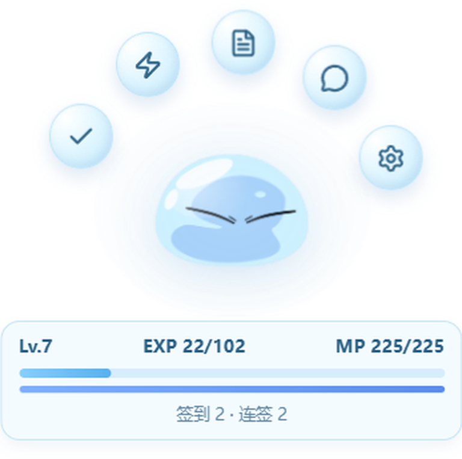
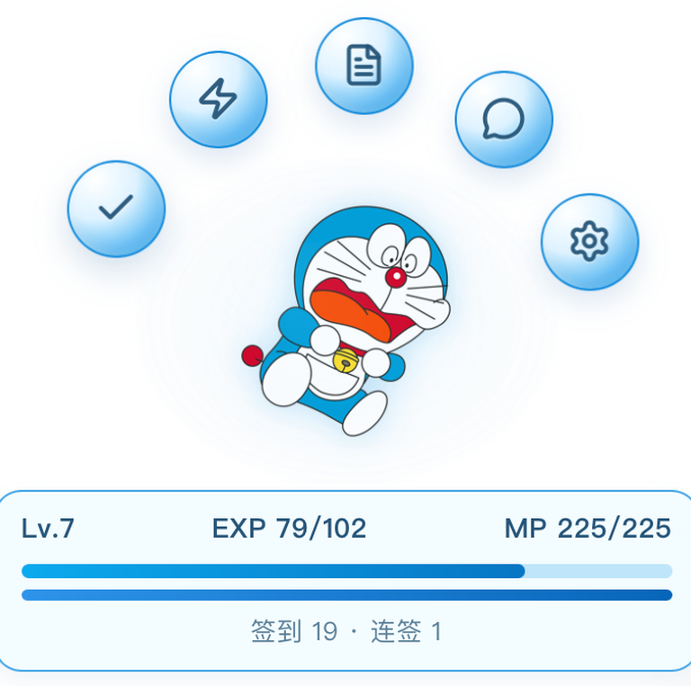
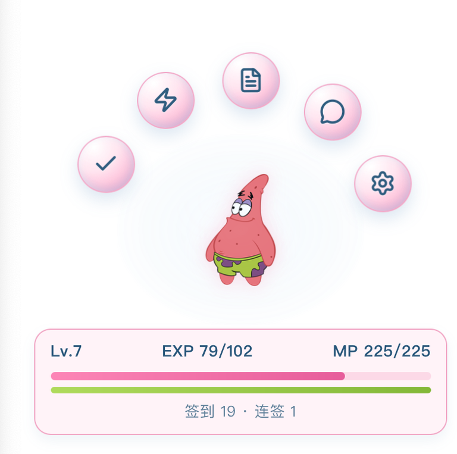

# 利姆露桌面助手

基于 `Tauri 2 + React + TypeScript + Vite` 的桌面助手应用，当前聚焦桌面场景，提供宠物交互、聊天和备忘录能力。

## 应用预览






## 功能特性

- 透明、置顶、无边框的主窗口
- 聊天与备忘录子窗口（Tauri 多窗口）
- LLM 聊天能力（支持流式返回与上下文轮数控制）
- 可插拔 LLM 接口适配：`OpenAI Compatible`、`ClaudeCode Messages`、`自定义直连`
- 聊天消息 Markdown 渲染（`react-markdown + remark-gfm`）
- 消息复制、代码块复制、聊天记录复制

## 技术栈

- 前端：`React`、`TypeScript`、`Vite`
- 桌面端：`Tauri 2`
- 渲染增强：`react-markdown`、`remark-gfm`

## 环境要求

- `Node.js 18+`（建议 LTS）
- `npm 9+`
- `Rust`（`rustup` + `cargo`）
- `WebView2 Runtime`（Windows）
- `Visual Studio C++ Build Tools`（Windows 打包推荐）

## 快速开始

1. 安装依赖

```bash
npm install
```

2. 启动桌面开发环境

```bash
npm run tauri dev
```

3. 仅启动前端（不拉起桌面窗口）

```bash
npm run dev
```

## LLM 配置说明

- 服务商支持：`OpenAI`、`ClaudeCode`、`自定义兼容`
- 仅当服务商为 `自定义兼容` 时显示“接口形态”
- 接口形态支持：`openai-compatible`、`claude-code`、`custom`
- 当接口形态为 `custom` 时，`Base URL` 可编辑，并按完整 URL 直连（不自动追加后缀）
- 非 `custom` 形态下，`Base URL` 只读，系统自动拼接请求后缀：
  - `openai-compatible` -> `/chat/completions`
  - `claude-code` -> `/messages`
- 最小兼容模式开启时仅发送基础入参（如 `model/messages`），细节参数（`temperature/top_p/penalty/stop`）会被忽略

## Hatch Pet 风格拓展

- 已支持接入现有 `hatch-pet` 包，无需在本项目内构建宠物素材
- 安装入口：设置面板 `风格` 区域的“上传 zip 安装”
- zip 包需包含 `pet.json` 和 `spritesheet` 文件（`pet.json` 中的 `spritesheetPath` 需可定位到对应文件）
- 安装成功后会自动写入本地安装记录，并在风格下拉中新增对应 `hatch-pet` 风格
- 菜单与面板主题会根据宠物主题色（或从 spritesheet 自动提取的主色）进行适配

## 默认配置

默认值来源于 `src/utils/settings.ts`：

| 配置项 | 默认值 |
| --- | --- |
| 吞噬功能 | 开启 |
| 启用聊天 | 开启 |
| 最小兼容模式 | 开启 |
| Provider | `openai` |
| 接口形态 | `openai-compatible` |
| Base URL | `https://it-ai.fineres.com/v1` |
| Model | `gpt-5.3-codex` |
| API Key | 空 |
| 上下文轮数 | `20` |
| 系统提示词 | `你是利姆露桌面助手，在回答时，请在符合你史莱姆人设的情况下，用简洁、明确、友好的中文回复。` |

## 项目结构

```text
apps/desktop/
├─ src/
│  ├─ components/      # UI 组件（含设置面板）
│  ├─ styles/profiles/ # 角色主题配置
│  ├─ assets/          # 思考动图等静态资源
│  ├─ utils/           # LLM 请求、配置归一化等工具
│  └─ types/           # 全局类型定义
├─ public/             # 角色主图等公共静态资源
├─ src-tauri/          # Tauri Rust 侧代码与打包配置
└─ README.md
```

## 常用命令

```bash
# 前端开发
npm run dev

# 前端构建
npm run build

# 前端预览
npm run preview

# Tauri 命令（dev/build 等）
npm run tauri

# 安全模式开发脚本（PowerShell）
npm run tauri:dev:safe
```

## 构建与发布

前端构建：

```bash
npm run build
```

桌面打包：

```bash
npx tauri build
```

## 许可证

本项目采用 [MIT License](./LICENSE)。
